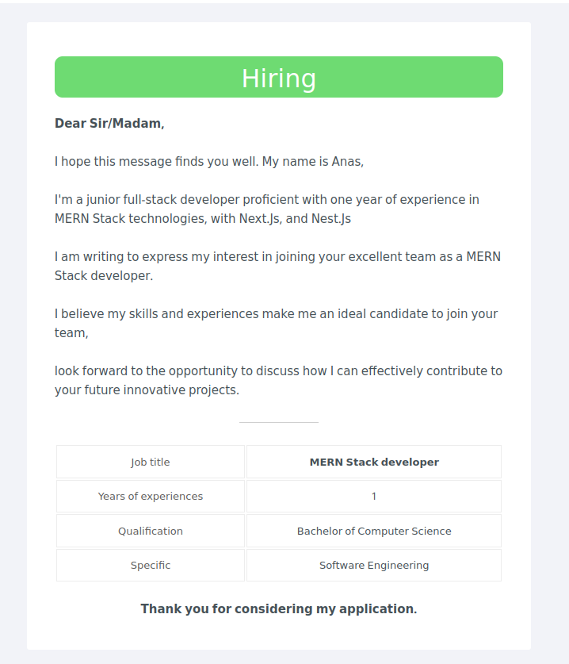

# Cv Sender

- **CV Sender** is a **dashboard** that contains companies data. we use it for marketing my clients' resumes and sending them to companies emails.
- It streamlines **_the process of managing company data_** and facilitating the **_marketing of client resumes_** by seamlessly sending them to company emails.
- Key features include **_adding_** and **_editing_** company information, **_promoting resumes_**, **_creating_** and **_sending invoices_**, and **_viewing invoice details_**.

## Technologies Used

- `React.js`
- `Redux toolkit`
- `Tailwind css`
- `Node.js`
- `Express.js`
- `MongoDB`
- `Mongoose`
- `Multer & nodemailer`

### The dashboard consists of 5 main pages

- **Add Company Page**: This page allows you to add new company information.

- **All Companies Page**: Here, you can view a list of all the companies, search for specific ones, and apply filters.

- **Resume Promotion Page**: This page is dedicated to promoting resumes to potential employers.

- **Add Invoice Page**: You can use this page create, add new invoices and send it to client.

- **View All Invoices Page**: Here, you can see a list of all the invoices, search, show, delete for specific ones, and their details.

The website serves as a central hub for managing company data, marketing resumes, and handling invoices efficiently.

#### Another Pages

- **Edit Company Page**: This page allows you to edit the information of the current company.

- **View Invoice Page**: This page enables you to view specific details of a particular invoice and allows you to print it by pressing `Ctrl + P`.

- **Error Page**: If any error occurs in the application or if a non-existent page is accessed, this page will be displayed to the users.

### Installation

To run the project locally, follow these steps:

- First, you need to **[install node.js](https://nodejs.org/en)**
- Clone this repository.
- Install dependencies using run this command in the root directory `npm run setup`.
- Configure environment variables
  Create the **.env** file in the root directory and add the following

  ```sh
  NODE_ENV=
  DATABASE_URL= "your mongodb url"
  PORT=

  GOOGLE_EMAIL=
  GOOGLE_PASSWORD=""

  VITE_API_URL=
  ```

### Run The App From root directory

```sh
#  To run client (:3000) with backend(:5100)
$ npm run dev

#  To run client (:3000) only
$ npm run client

# To run backend (:5100) only
$ npm run server
```

### Screenshot




